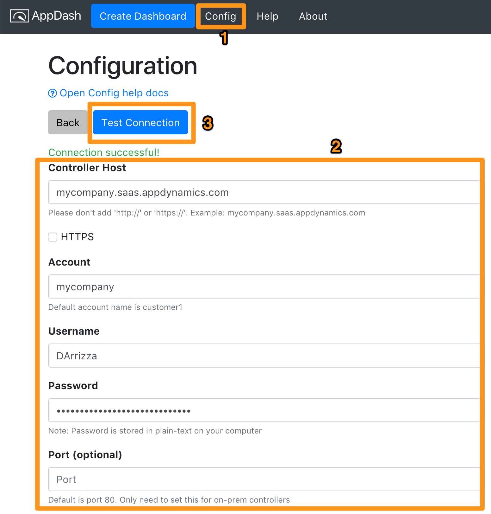

# Name

Create AppDynamics dashboards at ⚡ speed

- [Features](#features)
- [Getting Started](#getting-started)
- [Download](#download)
- [Contributing](docs/contributing.md)
- [Maintainer](#maintainer)
- [Help and FAQ](docs/help.md)

## Features

## Getting Started

### Download

Download it here - https://github.com/Appdynamics/AppDash/releases/latest

- **Mac:** Unzip the file, then drag it to your `Applications` folder
- **Windows:** No installation necessary! Just double click the exe file.
- **Linux:** Wow, you're so `1337h4x0r`. Make Richard Stallman proud and run it from the JS source - [docs](docs/contributing.md)

### Config

[Config](docs/config.md) tells AppDash how to connect to the AppDynamics controller.

## Contributing

[Contributing](docs/contributing.md) - Like AppDash? Anyone is welcome to help make it better

## Maintainer

Created and maintained by Daniel Arrizza. You can reach me at daniel (dot) arrizza (at) appdynamics.com

## Help and FAQ

[Help docs](docs/help.md) - A guide to each screen in the app and FAQ

