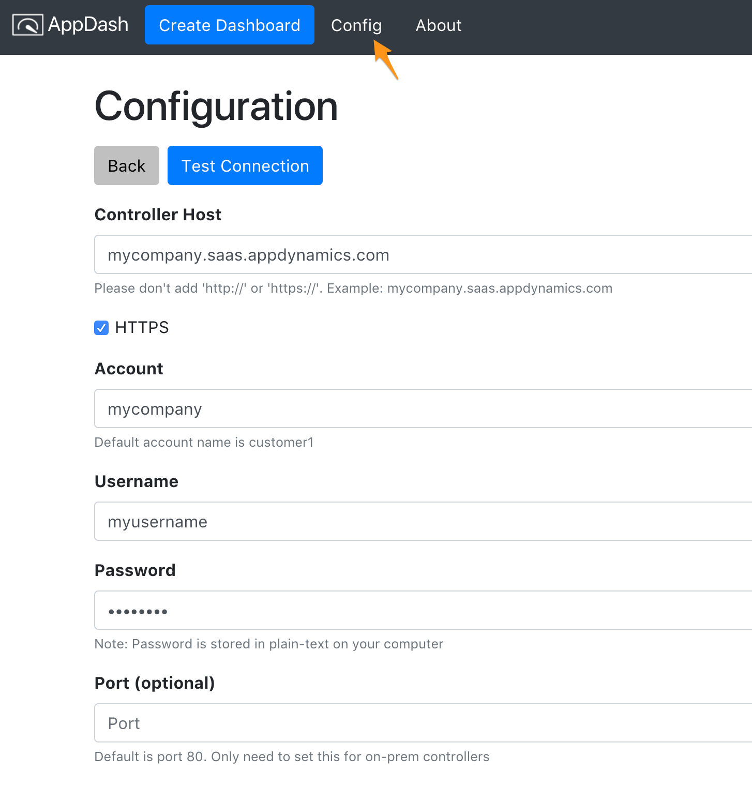

# Config

The config screen tells *AppDash* how to connect to the controller. The below is an example of connecting to a SaaS controller.

Click on `Test Connection` to make sure it works. If it doesn't successfully connect, here are some things to check:

- Can you login to the controller successfully?
- Did you type in the info correctly?
- Open the developer tools console by going to `View > Toggle Developer Tools`. Open up the `Console` and look for errors there

## Limitations

Currently, it does not support connections through a proxy. 