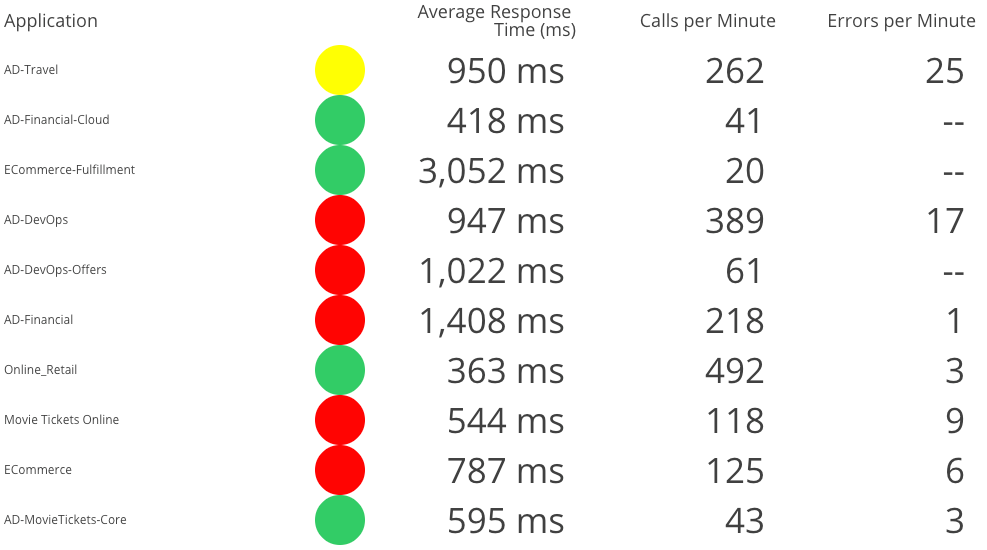
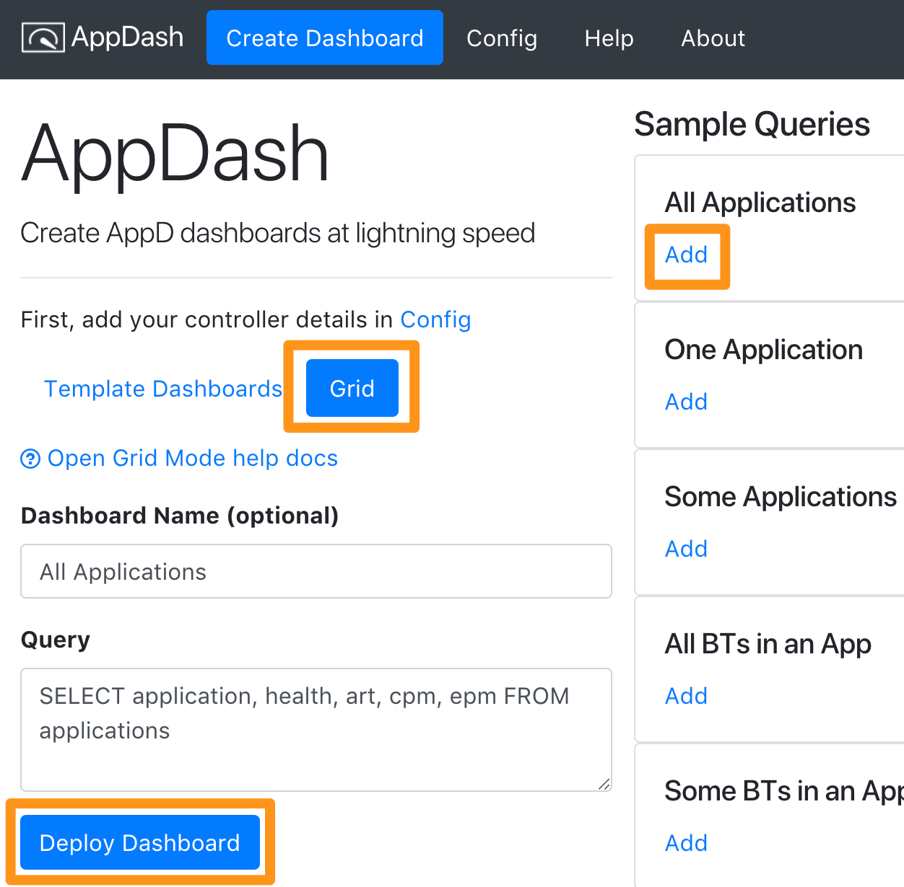

# Grid Mode

- [Example Queries](#example-queries)
- [Building a Query](#building-a-query)

## Try Grid Mode

To deploy a dashboard in [Grid Mode](docs/grid.md), pick a sample query (here we picked 'All Applications'), and click 'Deploy Dashboard'.

## Example Queries

- All Applications: `SELECT application, health, art, cpm, epm FROM applications`
- One Application: `SELECT application, health, art, cpm, epm FROM applications WHERE application = "MyApp"`
- Some Applications: `SELECT application, health, art, cpm, epm FROM applications WHERE application REGEXP "MyApp1|MyApp2|MyApp3"`
- All BTs in an App: `SELECT bt, health, art, cpm, epm FROM applications WHERE application = "MyApp"`
- Some BTs in an App: `SELECT bt, health, art, cpm, epm FROM applications WHERE application = "MyApp" AND bt REGEXP "MyBT.*"`
- Some BTs from different Apps: `SELECT bt, health, art, cpm, epm FROM applications WHERE application REGEXP "MyApp1|MyApp2|MyApp3" AND bt REGEXP "Login.*"`
- All Tiers in an App: `SELECT tier, health, art, cpm, epm FROM applications WHERE application = "MyApp"`
- All Nodes in an App: `SELECT node, health, art, cpm, epm FROM applications WHERE application = "MyApp"`
- All SEs in an App: `SELECT se, art, cpm, epm FROM applications WHERE application = "MyApp"`
- SEs with Health Rules: `SELECT se, health(art), health(error), art, cpm, epm FROM applications WHERE application REGEXP "MyApp"`
- Some SEs in different Apps: `SELECT se, art, cpm, epm FROM applications WHERE application REGEXP "MyApp" AND se REGEXP "Login.*"`

## Building a Query

A query takes 3 parts: 

- [SELECT](#select) (what columns to build)
- [FROM](#from) (what type of data)
- [WHERE](#where) (optional - how to filter on the data)

### SELECT

#### Supported Objects

- application
- tier
- node
- bt (business transaction)
- se (service endpoints)

#### Supported metrics

- **art** (average response time)
- **cpm** (calls per minute)
- **epm** (errors per minute)

Does not yet support [custom metric paths](https://github.com/Appdynamics/AppDash/issues/40)

#### Health rules

- **All objects (except service endpoints):** You can add `health` to show a status light on any health rules that affect that object
- **Service endpoints:** You can add `health(art)` and/or `health(error)` to have AppDash upload health rules to the controller. Running the query twice will overwrite the existing health rules. Note, it creates one health rule per service endpoint. This can get big pretty fast

#### AS

The `AS` query allows you to rename a column's header.

For example: `SELECT application AS "Business Applications", art, cpm....`

#### Not yet supported objects:

- [backends](https://github.com/Appdynamics/AppDash/issues/26)
- [information points](https://github.com/Appdynamics/AppDash/issues/32)
- [errors](https://github.com/Appdynamics/AppDash/issues/31)
- [EUM](https://github.com/Appdynamics/AppDash/issues/28)
- [DB](https://github.com/Appdynamics/AppDash/issues/27)
- SIM
- analytics

`SELECT` does not yet support:

- [SELECT nesting](https://github.com/Appdynamics/AppDash/issues/33) - for example, can't yet do `SELECT application, tiers, cpm FROM applications`. In the current state, it can get confusing if things are named the same across applications

### FROM

Currently, `FROM` only supports applications (APM data). Ex: `SELECT ... FROM applications`

### WHERE

The `WHERE` clause (optional) allows you to filter your query.

Operators:
- `=` Check for eqality. Example: `SELECT application, cpm FROM application WHERE application = "ECommerce"`
- `REGEXP`: Check with regex. Can use it to select a few values `...WHERE application REGEXP "App1|App2"`, or any arbitrary regex `...WHERE application REGEXP "ECommerce.*"`

LOGICAL operators:
- `AND`: Check for multiple expressions being true. Example: `Some BTs in an App: SELECT bt, health, art, cpm, epm FROM applications WHERE application = "MyApp" AND bt REGEXP "MyBT.*"`

`WHERE` does not yet support:

- [WHERE IN](https://github.com/Appdynamics/AppDash/issues/21)
- [WHERE on metric values](https://github.com/Appdynamics/AppDash/issues/22) (current average response time is > x)
- `OR`

### Not yet supported

- [LIMIT](https://github.com/Appdynamics/AppDash/issues/19)
- [SORT BY](https://github.com/Appdynamics/AppDash/issues/20)