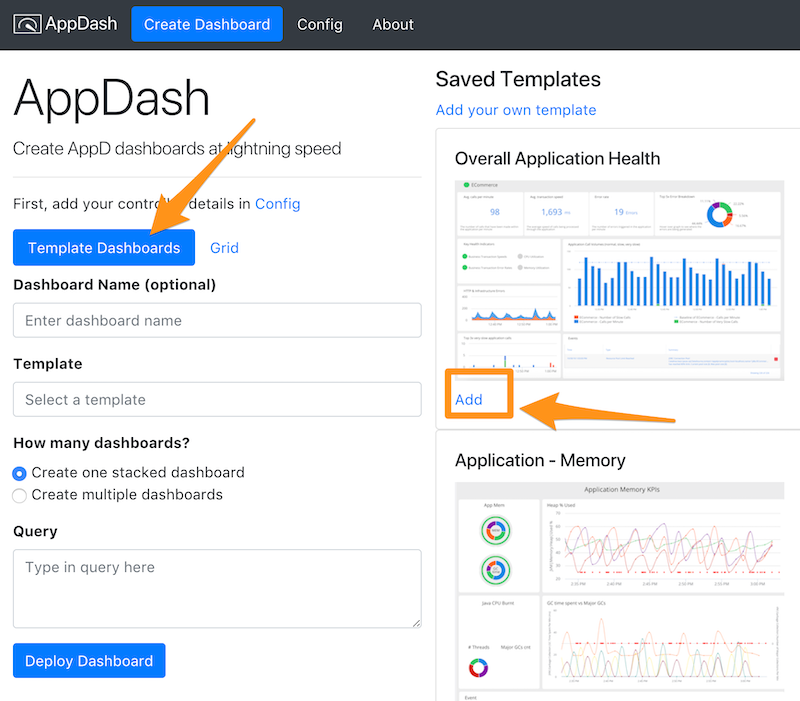
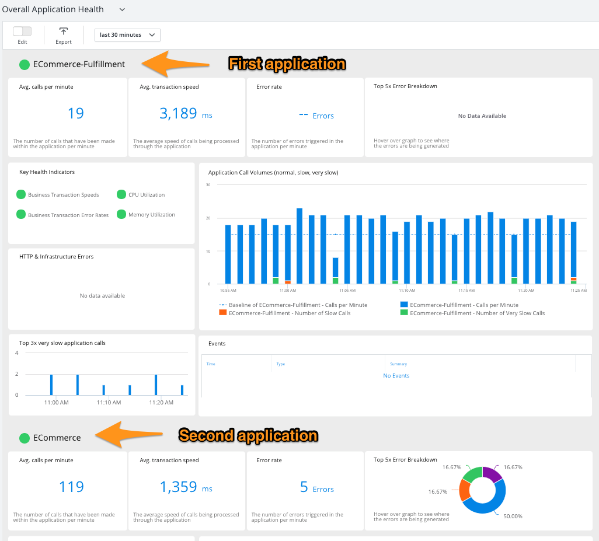
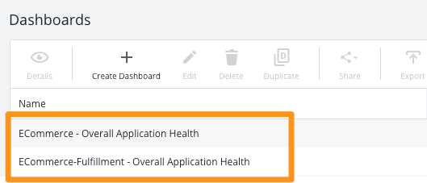

# Template Mode

- [Try Template Mode](#try-template-mode)
- [Using existing templates](#using-existing-templates)
- [Adding your own template](#adding-your-own-template)
- [Limitations](#limitations)

## Using existing templates

**Step 1:** Go to `Template Dashboards` and pick a template by clicking `Add`

**Step 2:** Change the name (optional) under `Dashboard Name`

**Step 3:** Decide between `Create one stacked dashboard` and `Create multiple dashboards` (only matters if you have more than one application selected in **Step 4**)

- `Create one stacked dashboard` - You will end up with one dashboard, and can scroll down through it to see the info for each application

- `Create multiple dashboards` - It will create one dashboard per application, adding the application name to the beginning of the dashboard name

**Step 4:** Modify the query to select which applications

- All applications: `SELECT application FROM applications`
- One application: `SELECT application FROM applications WHERE application = "ECommerce"`
- A few applications: `SELECT application FROM applications WHERE application REGEXP "MyApp1|MyApp2|MyApp3"`
- Matches regex: `SELECT application FROM applications WHERE application REGEXP "ECommerce"`

## Adding your own template

You can easily add your own templates into AppDash. Here's how to do it:

1. Create a dashboard in AppD
1. Export the dashboard
1. Open the JSON, and replace all instances of the application name with `$APPLICATION`
1. Open AppDash, and go to 'Template Dashboards'
1. Under 'Saved Templates', click on 'Add your own template'
1. Fill out the name, dashboard JSON (the one you replaced with `$APPLICATION`), and click `Add Dashboard Template`
1. Now, it's a selectable template dashboard!

Feel free to share your template with the AppDash community! Please open a GitHub issue with a screenshot and the JSON - https://github.com/Appdynamics/AppDash/issues/

### Limitations

Currently, the tool supports templates that are scoped to an application level. If you can do a simple application name string replace, that will work. 